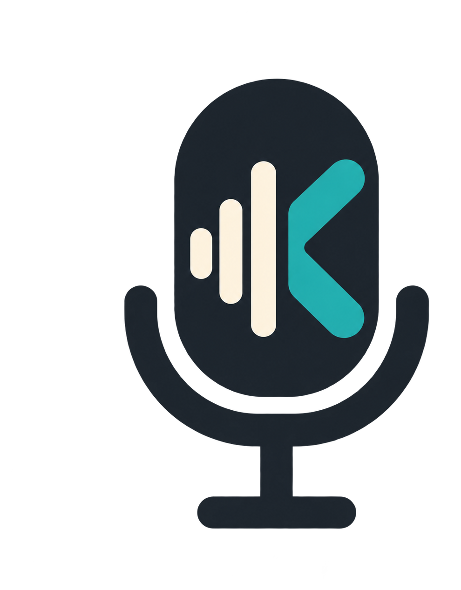
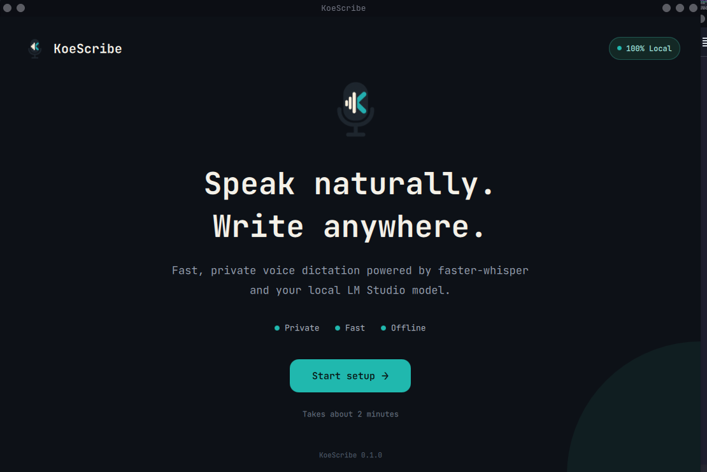
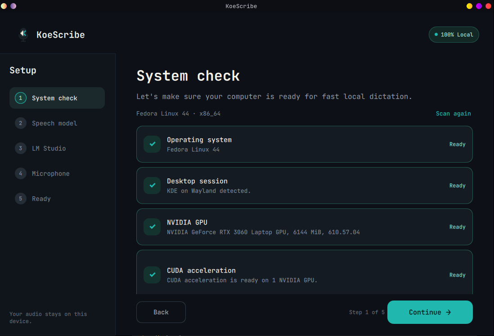
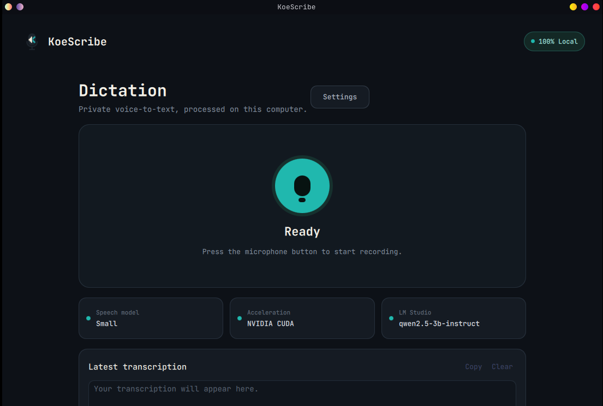
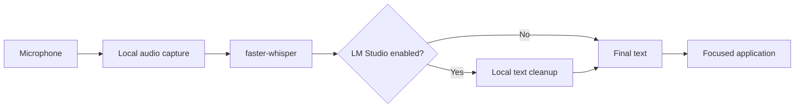

# KoeScribe

<p align="center">
  
</p>

<h1 align="center">KoeScribe</h1>

<p align="center">
  Fast, private, local-first voice dictation for your desktop.
</p>

<p align="center">
  
  
  
  
  
  
</p>

**Private, local-first voice dictation for the desktop.**

KoeScribe is an open-source desktop application that turns natural speech into
text using local AI models. It is being designed as a user-friendly alternative
to cloud dictation tools: audio transcription runs locally with
[faster-whisper](https://github.com/SYSTRAN/faster-whisper), while an optional
model served by [LM Studio](https://lmstudio.ai/) can clean up punctuation,
grammar, and formatting.

> [!IMPORTANT]
> KoeScribe is currently in early development. The setup wizard is functional;
> recording, transcription, global shortcuts, and focused-application text
> insertion are the next implementation stages.

## Goals

- Keep microphone audio and dictated text on the user's computer.
- Provide fast NVIDIA CUDA transcription with a safe CPU fallback.
- Make model selection and hardware setup understandable to non-technical users.
- Support dictation into any focused desktop application.
- Use LM Studio optionally—basic transcription must work without it.
- Build a polished native desktop experience with Python and Qt Quick/QML.


## Screenshots

### Welcome



### Guided setup



### Local dictation


## Current progress

### Completed

- Modern welcome screen and five-step onboarding flow.
- Linux and Windows system detection foundation.
- KDE Plasma and Wayland session detection.
- NVIDIA GPU and CUDA runtime checks.
- Guided app-local installation of CUDA 12 cuBLAS and cuDNN 9 on Linux.
- CTranslate2 CUDA device verification.
- Dynamic faster-whisper model catalogue and hardware-aware recommendation.
- Whisper model download and detection of previously downloaded models.
- LM Studio local-server connection testing.
- Dynamic discovery and selection of LM Studio chat models.
- Microphone discovery, selection, hot-plug refresh, and five-second input test.
- Local persistence of onboarding choices.
- Automatic onboarding skip after successful setup.

### In progress / planned

- Main dictation dashboard.
- Audio recording and conversion to mono 16 kHz PCM.
- GPU-accelerated faster-whisper transcription.
- Optional LM Studio text cleanup pipeline.
- Configurable global push-to-talk shortcut.
- Text insertion into the focused application on KDE Plasma Wayland.
- Recording history and clipboard actions.
- Settings screen and setup reconfiguration.
- Windows integration, packaging, installers, and automated tests.

## Setup flow

| Step | Purpose |
| --- | --- |
| System check | Detect the OS, desktop session, GPU, CUDA runtime, and audio input |
| Speech model | Recommend, download, and select a faster-whisper model |
| LM Studio | Connect to the local OpenAI-compatible API and select a chat model |
| Microphone | Select an input device and run a short recording test |
| Ready | Review and save the configuration |

## Planned dictation pipeline



## Technology stack

| Area | Technology |
| --- | --- |
| Language | Python 3.13+ |
| Desktop UI | PySide6, Qt Quick, QML |
| Package management | uv |
| Speech recognition | faster-whisper, CTranslate2 |
| GPU acceleration | NVIDIA CUDA 12, cuBLAS, cuDNN 9 |
| Local language model | LM Studio OpenAI-compatible local server |
| Audio devices | Qt Multimedia, PipeWire on Linux |
| Configuration | platformdirs, local JSON settings |
| Initial Linux target | Fedora, KDE Plasma, Wayland |
| Planned platform | Windows |

## Project structure

```text
koescribe/
├── pyproject.toml
├── uv.lock
├── README.md
└── src/
    └── koescribe/
        ├── __init__.py
        ├── app.py
        ├── controllers/
        │   ├── setup_controller.py
        │   ├── cuda_controller.py
        │   └── microphone_controller.py
        ├── services/
        │   ├── system_service.py
        │   ├── cuda_service.py
        │   ├── whisper_service.py
        │   ├── lm_studio_service.py
        │   ├── microphone_service.py
        │   └── settings_service.py
        └── qml/
            ├── Main.qml
            ├── assets/
            ├── components/
            │   └── PrimaryButton.qml
            └── pages/
                ├── SetupScreen.qml
                ├── SpeechModelPage.qml
                ├── LMStudioPage.qml
                ├── MicrophonePage.qml
                └── ReadyPage.qml
```

## Requirements

### General

- Python 3.13 or newer
- [uv](https://docs.astral.sh/uv/)
- A working microphone

### Recommended Linux configuration

- Fedora Linux
- KDE Plasma on Wayland
- PipeWire
- NVIDIA GPU with a working driver
- CUDA 12 cuBLAS and cuDNN 9 for GPU transcription

KoeScribe can continue in CPU mode when compatible NVIDIA hardware or CUDA
libraries are unavailable.

## Development setup

Clone the repository:

```bash
git clone https://github.com/nithesh113/koescribe.git
cd koescribe
```

Create the environment and install locked dependencies:

```bash
uv sync
```

Run KoeScribe:

```bash
uv run koescribe
```

If the project script is not available yet, run the module directly:

```bash
uv run python -m koescribe.app
```

## CUDA acceleration

The setup wizard checks both system library locations and KoeScribe's virtual
environment. When an NVIDIA GPU is available but the required runtime is
missing, the wizard can install the Linux runtime packages locally into the
project environment.

Manual development command:

```bash
uv pip install nvidia-cublas-cu12 "nvidia-cudnn-cu12==9.*"
```

KoeScribe then preloads the app-local libraries and asks CTranslate2 to verify
that a CUDA device is actually usable. Seeing a CUDA version in `nvidia-smi`
alone is not treated as successful runtime verification.

## LM Studio setup

LM Studio is optional. To enable text cleanup:

1. Install and open LM Studio.
2. Download an instruction-tuned chat model that fits your available memory.
3. Load the model.
4. Start the LM Studio local server.
5. Keep the default endpoint `http://127.0.0.1:1234/v1`, or enter your custom
   local endpoint in KoeScribe.
6. Return to KoeScribe, test the connection, and select the model.

Embedding-only models are excluded from the cleanup-model selector.

## Development principles

- **Local first:** audio and text processing should remain on-device by default.
- **Optional enhancement:** LM Studio improves text but is not required.
- **Responsive UI:** hardware checks, downloads, and inference run outside the
  QML UI thread.
- **Honest status:** KoeScribe verifies capabilities instead of assuming that an
  installed driver means CUDA inference works.
- **Safe setup:** the app does not silently install or replace system drivers.
- **Graceful fallback:** failures should produce actionable guidance and preserve
  CPU transcription whenever possible.

## Roadmap

- [x] Application shell and visual design system
- [x] Five-step onboarding wizard
- [x] System, GPU, CUDA, LM Studio, and microphone detection
- [x] Whisper model selection and download
- [x] Persistent setup configuration
- [ ] Main dictation screen
- [ ] Audio capture service
- [ ] faster-whisper transcription service
- [ ] LM Studio cleanup service
- [ ] KDE Wayland global shortcut
- [ ] Focused-application text insertion
- [ ] History and settings
- [ ] Windows support validation
- [ ] Application packaging and releases

## Privacy

KoeScribe is designed to process audio locally. LM Studio communication uses a
user-configured local endpoint. Future network-dependent features must be
explicitly documented and opt-in.

Downloaded speech models and application settings are stored in the appropriate
per-user data/configuration directories rather than committed to this
repository.

## Contributing

The project is still establishing its architecture. Issues and focused pull
requests are welcome. Before submitting a change:

1. Keep UI work consistent with the existing dark, non-gradient design system.
2. Keep blocking work outside the QML UI thread.
3. Avoid hard-coded hardware names and machine-specific paths.
4. Include a clear manual fallback for automated setup actions.
5. Test behavior with optional services such as LM Studio disabled.

## License

A license has not yet been selected. Add a `LICENSE` file before inviting broad
external contributions or publishing packaged releases.

## Acknowledgements

- [faster-whisper](https://github.com/SYSTRAN/faster-whisper)
- [CTranslate2](https://github.com/OpenNMT/CTranslate2)
- [Qt for Python / PySide6](https://doc.qt.io/qtforpython-6/)
- [LM Studio](https://lmstudio.ai/)

---

KoeScribe is being built to make fast, private desktop dictation approachable
without requiring cloud speech or language-model APIs.
